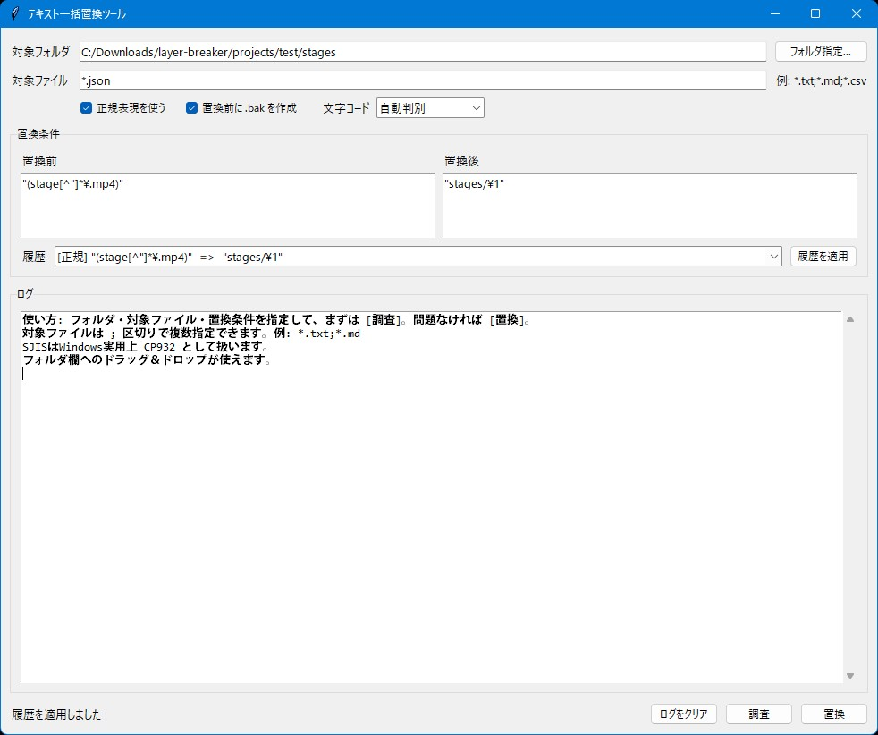

# Text Bulk Replacer



## 機能概要

指定したフォルダ配下のテキストファイルをまとめて検索・置換できるGUIツールです。
正規表現にも対応していて、置換前に「どのファイルのどの行が対象になるか」を調査できます。

### 主な機能

* フォルダ配下の対象ファイルを一括検索・一括置換
* サブフォルダ内のファイルもまとめて処理
* `*.txt`、`*.md`、`*.csv` など、対象ファイルのパターン指定に対応
* 通常文字列置換／正規表現置換を切り替え可能
* 置換前・置換後の内容を履歴から呼び出し可能
* 履歴は重複なしで最大10件まで保存
* 対象フォルダ、対象ファイル、正規表現ON/OFF、`.bak`作成などの前回設定を自動復元
* 置換前に対象箇所を確認できる「調査」機能
* ログテキストに対象ファイル名、行番号、置換箇所を表示
* 置換時に `.bak` バックアップを作成可能
* 文字コードは自動判別に対応
* UTF-8 / SJIS / EUC-JP の手動指定にも対応
* 日本語ファイル・日本語テキスト対応
* `tkinterdnd2` が入っていればフォルダのドラッグ＆ドロップにも対応

### 一言で言うと

「複数ファイルのテキストを、安全確認しながら一括置換するツール」

## 使い方

1. **アプリを起動する**

   ターミナルで以下を実行します。

   ```bash
   python text-bulk-replacer.py
   ```

   基本機能はPython標準ライブラリだけで動きます。

   ドラッグ＆ドロップを使いたい場合は、必要に応じて以下をインストールしてください。

   ```bash
   pip install tkinterdnd2
   ```

   文字コードの自動判別精度を少し上げたい場合は、以下も入れておくと便利です。

   ```bash
   pip install charset-normalizer
   ```

2. **フォルダを指定する**

   「フォルダ指定」ボタンから、置換対象にしたいフォルダを選びます。
   `tkinterdnd2` が入っている環境では、フォルダのドラッグ＆ドロップでも指定できます。

3. **設定を行う**

   主な設定項目は以下です。

   * **対象ファイル指定**
     `*.txt` や `*.md` のように対象ファイルを指定します。
     複数指定したい場合は、`;` 区切りで入力します。

     例：

     ```text
     *.txt;*.md;*.csv
     ```

   * **置換前**
     検索したい文字列、または正規表現を入力します。

   * **置換後**
     置換後の文字列を入力します。

   * **正規表現を使う**
     ONにすると、置換前を正規表現として扱います。
     正規表現ONの場合、置換後では `\1` などの後方参照も使えます。

   * **文字コード**
     通常は「自動判別」でOKです。
     うまく読めない場合は、`UTF-8`、`SJIS`、`EUC-JP` から手動指定できます。

   * **.bak作成**
     ONにすると、置換前の元ファイルを `.bak` としてバックアップします。
     一括置換は事故ると怖いので、基本的にはON推奨です。

4. **調査ログを確認する**

   「調査」ボタンを押すと、実際には置換せずに、対象になるファイルと行番号、該当箇所をログに表示します。
   置換前にここで内容を確認しておくと安全です。

5. **置換を実行する**

   調査ログで問題がなければ、「置換」ボタンを押します。
   指定フォルダ配下の対象ファイルに対して、一括で置換処理を行います。

   `.bak作成` がONの場合は、置換前のファイルがバックアップとして保存されます。

## おすすめ設定例

### Markdownやテキストをまとめて置換したい場合

```text
対象ファイル: *.txt;*.md
文字コード: 自動判別
.bak作成: ON
```

### CSVも含めて置換したい場合

```text
対象ファイル: *.txt;*.md;*.csv
文字コード: 自動判別
.bak作成: ON
```

### 正規表現でファイルパスを書き換える例

たとえば、以下のような文字列を

```text
"stage08_reward.mp4"
```

以下のように変換したい場合、

```text
"stages/stage08_reward.mp4"
```

正規表現ONで次のように指定します。

```text
置換前: "(stage[^"]*\.mp4)"
置換後: "stages/\1"
```

まずは必ず「調査」ボタンで対象箇所を確認してから置換するのがおすすめです。

## 必要環境

* Python 3.10以上
* Tkinter

  * 通常のPython環境なら標準で入っています
* 任意ライブラリ

  * `tkinterdnd2`

    * フォルダのドラッグ＆ドロップを使いたい場合
  * `charset-normalizer`

    * 文字コード自動判別の補助に使いたい場合

基本機能だけなら追加インストールなしでも動きます。

任意ライブラリを入れる場合：

```bash
pip install tkinterdnd2 charset-normalizer
```

## ライセンス

**MIT License** で公開しています。
ご自由に使って、改変して、参考にしてください。
ただし**自作発言はNG**でお願いします。
